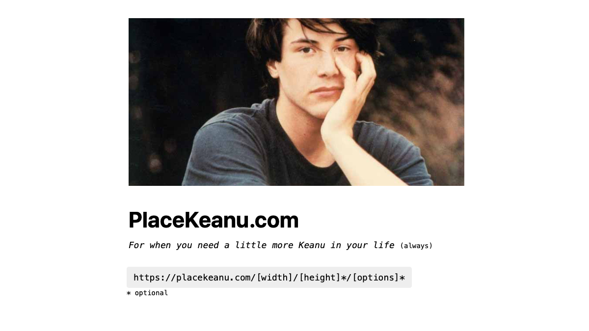

# PlaceKeanu.com
*For when you need a little more Keanu in your life*

## How to use this *lifechanging* service
Simply paste a link in this format, wherever you need him:

`https://placekeanu.com/[width]/[height]*/[options]*` 
(* optional)

If you don't specify a height, you'll get a **square** Keanu... 
...shape-wise, that is, because Keanu is always mindblowingly awesome.

## Available [options]
* Young Keanus only: `y`
* Grayscale: `g`

*Note: Some Keanus are grayscale by default.*

## Some examples
* Any Keanu: [https://placekeanu.com/200/150](https://placekeanu.com/200/150)
* Young Keanu: [https://placekeanu.com/500/300/y](https://placekeanu.com/500/300/y)
* Square + Grayscale: [https://placekeanu.com/250/g](https://placekeanu.com/250/g)
* Young + Grayscale: [https://placekeanu.com/300/550/yg](https://placekeanu.com/300/550/yg)

If you, for instance, need a little more Keanu in your website projects, you can include him with an :

``

## How does it work?
When you send a valid request to this website, a random photo of [Keanu Reeves](https://en.wikipedia.org/wiki/Keanu_Reeves) is displayed.

The photos are cached on your end for 1 day, which is why you don't get a new Keanu on every page load.

While some placeholder image websites dynamically create new images, this service is SVG-based. For this to work properly, all photos have been encoded to Base64.

## Contributing
If you found a bug that needs fixing, or have a feature you want to discuss or implement, feel free to open an issue or a pull request. Any contribution is appreciated, big or small!

## License
All Keanus belong to their respective owners. See the full [Keanu list](https://placekeanu.com/keanus) for photo attributions.

Distributed under the MIT License © [Alexander Sandberg](https://github.com/alexandersandberg)

---

Thanks for checking out my project! _You're breathtaking_. ❤️